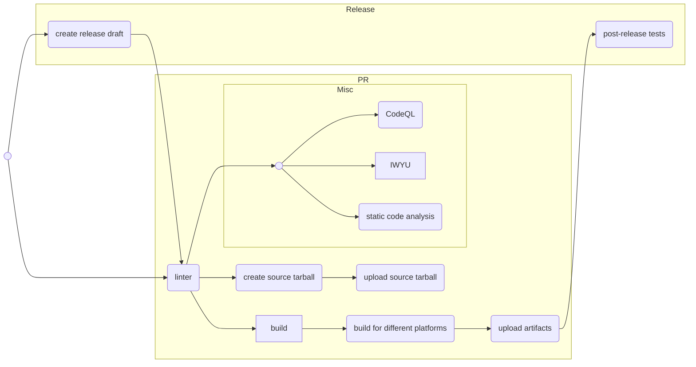
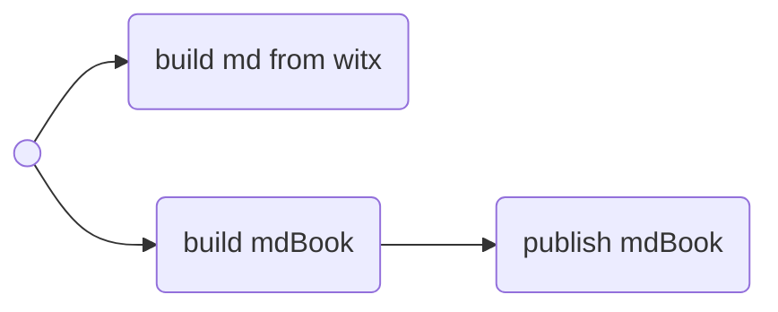
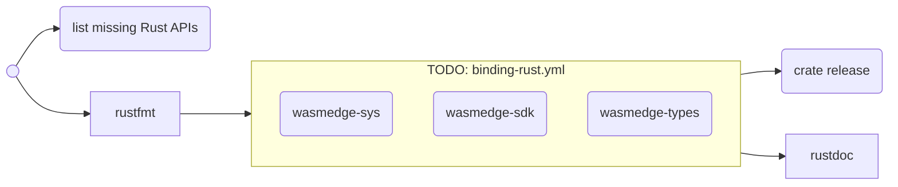

# CI Workflows

```mermaid
flowchart LR;
    _(( ))-->lint
    _-->release(create release draft)

    subgraph PR
    lint-->build
    build-->build_platforms(build for different platforms)
    build_platforms-->upload_artifacts(upload artifacts)
    lint-->tarball(create source tarball)
    tarball-->upload_tarball(upload source tarball)
    lint-->_misc(( ))
    subgraph Misc
    _misc-->codeql(CodeQL)
    _misc-->IWYU
    _misc-->infer(static code analysis)
    end
    end

    subgraph Release
    release-->lint(linter)
    upload_artifacts-->tests(post-release tests)
    end
```

## Docs

```mermaid
flowchart LR;
    _(( ))-->witx(build md from witx)
    _-->mdbook
    mdbook(build mdBook)-->publish(publish mdBook)
```

## Rust

```mermaid
flowchart LR;
    _(( ))-->rust_sys(list missing Rust APIs)
    _-->rustfmt-->rust
    rust-->crate(crate release)
    rust-->rustdoc
    subgraph rust[TODO: binding-rust.yml]
    direction TB
    crate-rust(wasmedge-sys)
    crate-rust-sdk(wasmedge-sdk)
    crate-rust-types(wasmedge-types)
    end
```

## Installer
- test install.sh and uninstall.sh
